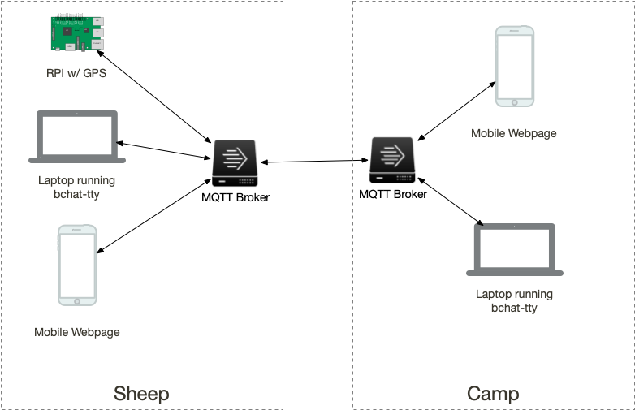

BAAAHS Chat (B-Chat)
====================

This repo defines the chat server, protocol, and some (maybe all) of the clients for the BAAAHS chat system between the Sheep and Camp. The primary "art" that is being built around this for 2019 is to enable two low end chromebooks, one on the sheep and one in camp, to be able to send messages back and forth. We also expect to be able to have other clients connect such as a small RPI with a GPS that can tell everyone where it thinks it is at on a periodic basis.

This system uses some of the same network as Sparkle Motion but is being built separately from the lighting project and does not rely on it. There will almost certainly be connection between the two over time.

# Quick Start

Starting in the root of this repo using a Mac. You will need 3 terminal windows.

First make sure you have mosquitto installed.

    brew install mosquitto

Now in the first window, start mosquitto

     mosquitto -c mosquitto/local.conf

In a second window (still in the root of the repo) start the first chat client using an id of "first"

     bin/bchat-tty-mac id=first

In a third window start a second chat client with a different id, and this time enable the display of logging output directly in the UI

     bin/chat-tty-mac id=second log=true

At this point both client should show "mqtt:Connected" on the right hand side of the status bar. Anything typed in one window should appear in the other chat client. Use `/help` to show the help message - such as it is. Exit the client with `^c`.

# Further Reading

In addition to the documentation below, which largely dates to 2019, be sure to check the [developer doc](./doc/development.md) and the [Ansible README](./chromebooks/README.md) 

## Theory of Operation

At the core is the network. The network is conceptually two separate partions - one on the sheep and one at camp - that periodically manage to talk to each other. Hopefully all the time, but it's quite possible that this link will be intermittent. 

Additionally, from a user perspective this chat implementation is intentionally going to be very constrained. Basically it will be a one room IRC like service. We decided not to use regular IRC because it already has to many features and we don't want the distraction.

For transport reliability we're using [MQTT] servers, one on the sheep and one at the camp, with a bridge between them for exchanging messages between all the user-agent clients. We are using what is essentially the reference [MQTT] server named [mosquitto].

## Development Setup

You intentionally need very little to get started. You could use the spec defined below and none of the code from this repo, but you can also use the code from this repo.

You're going to need an MQTT broker to talk to, so you'll want to install [mosquitto]. On a reasonably modern Mac with [brew] installed you should be able to install [mosquitto] by

    brew install mosquitto
    
On my main machine the brew installation complained about a missing `/usr/local/sbin` that I had to go create by hand and then do a `brew link mosquitto` after I had done that. Hopefully this is a local me issue though.

With this repo checked out and [mosquitto] installed, from the `mosquitto` directory of this repo you should be able to start a local [mosquitto] server that binds to all interfaces of your machine by running

    /usr/local/sbin/mosquitto -c local.conf
    
That should give you a totally default server running on port `1883`. The `local2.conf` file can be used to start a second instance on a different port of `18830` which will then bridge itself to the first server and will pass all messages between them.

Now you need a client. The `bchat-tty` directory contains the code for a client written in go that we are using for the Chromebooks. You can also run this client locally multiple times in multiple terminal windows to get the real effect. 

If you just want to run a prebuilt version of the client try the version in the `bin` directory

    bin/bchat-tty-osx
    
That will _probably_ run on any Mojave machine. If it doesn't then you'll have to setup a dev environment for go, which isn't hard, but is beyond the current scope of this readme. So let's say that worked and you have a chat client running.

If you are running an [MQTT] server on `localhost:1883` then it should have connected to it and you will see any messages sent on the topics described below. If you don't have a local server running, start one, and it should connect.

***

When clients connect to an [MQTT] server they use a client id. [bchat-tty] uses the local machine id as it's client id which is good for the chromebooks but maybe not what you want in development because you want to run multiple copies of it in multiple windows. This id is separate from the "nick" that it uses when sending messages. The idea being that the "nick" might be user modifiable but this machine id is unique to the machine. This let's the [MQTT] server know which messages have gone to which machines and do all the right things to get the messages delivered.

So in order to multiple copies of [bchat-tty] you need to provide it some configuration which is done via the [Archer Configuration Language][archercl]. ACL is basically "json plus comments" and can be provided from files, from the command line, or from the environment. Instead of command line arguments, `bchat-tty` just uses the ACL infrastructure to figure out how it should behave.

> The main thing you need to know about ACL is that keys and values can be separated by colons or equals signs, and each command line argument is parsed as an individual string, so for simple non-whitespace keys and values you can set configuration keys from the command line like so.
>
>     key1:value1 key2=value2
>
> And if you needed more complex values you might write something like the following as a command line argument. The single quotes protect the string from the shell and the double quotes protect the url with it's colons from the ACL parser. 
>
>     'url: "tcp://10.0.1.1:1883"'

Thus, to run multiple clients on one machine, all you need is to to provide the different processes with slightly different configurations. So in one terminal window you might run

    bchat-tty-osx id:1 name:Sheep
    
And in another terminal you could run 

    bchat-tty-osx id:2 name:Camp
    
That should get you two terminals that can talk to each other.

> Note that ***all clients must have unique ids***. If an [MQTT] broker receives two TCP connections that both present the same client id, it assumes they are the same client and will drop the old connection. Since [bchat-tty] will auto reconnect if you run it twice without providing separate ids, the two instances will keep kicking each other off and things won't work.

With two clients running, and chatting back and forth, you should be able to add additional clients into the system that publish messages on topics as described below and they should show up in the running clients.

If you want to tell [bchat-tty] to connect to a broker somewhere other than localhost, you need to change the value of the **url** key.The **url** has to be a go formatted network address and if you're doing it from the command line pay attention to the escaping requirements as shown above.

If you want to specify configuration values using the environment, you would do that like so:

    export bchat_id=1000
    export bchat_name=Fred
    export bchat_url="tcp://localhost:18830"
    
And if you want to use configuration files you need to know that the ACL infrastructure loads a cascade of files starting with a system level, then a user specific file, then finally a directory specific file. After that it loads any files that are specified on the command line using the `-c` or `--config` command line parameters. 

    bchat-tty-mac -c bob.acl 
    
Will load the following files if they exist in this order:

    /etc/bchat.acl
    ~/.bchat.acl
    ./bchat.acl
    bob.acl

As mentioned earlier, ACL is essentially JSON-ish but allows comments in pretty much all styles, so if you wanted to setup some config files for your different instances an almost complete example of everything that [bchat-tty] understands with the default values it uses would be

    // The url for the MQTT server. Must be specified as a valid go tcp:// url.
    // Note that in ACL values that contain :'s must be quoted.
    url: "tcp://localhost:1883" 
    
    // The id to use. If not specified in a config file will default to a
    // unique machine identifier. How this is created is based on the hardware
    // and operating system of the machine.
    id: <default depends on the machine>
    
    // Default nick name to use until the user changes it
    name: Sheep
    
    // Whether to show the in-app log window by default
    log: false
    
The ACL code also recognizes a standard set of logging configuration values. See the [acl module documentation][archercl] if you're curious about those.

If you want to monitor what's going on in terms of messages being passed etc. there are various [MQTT tools](https://github.com/mqtt/mqtt.github.io/wiki/tools) available that might help you out. Since there are [MQTT client libraries](https://github.com/mqtt/mqtt.github.io/wiki/libraries) for pretty much every language this infrastructure can probably be used for all sorts of other projects as well.

## Topics

[MQTT] is a pub/sub system with a hiearchy of topics to which arbitrary messages may be published. Subscribers can subscribe using wildcards to get various parts of a potentially dynamic tree.

We're going to define the tree with more functionality than we plan to implement in rev 1 because the future always comes faster than you think. So while we are planning to only expose one room, we'll make it easy to add more later. Thus, a chat room has a place in the topic tree that starts with `bchat/rooms/`. The next segment in the topic is the room name. For rev 1, the only room anyone should use is **main** so the full topic for the room is `bchat/rooms/main`. 

Underneath each room we will have sub-topics as follows:

   - **.../{nick}/messages** - Messages sent by a given nick (Sheep or Station etc)
     
     It's likely that the user will be allowed to change the nick so this may or may not be a good idea. We maybe should use the client id instead. We'll figure it out later but presume there is one level of hierarchy here.
     
   - **.../{nick}/status** - Per user status information
   
     I don't know all of what will go into this message but this gives us a spot to dump a retained message indicating what was last known from this nick / location. Could be interesting technical data but could also contain things like what song is playing maybe? Although that specific data would be better served on it's own topic I think. 

In the future we might add things like a list of users or stats or something. Again - keep it simple for now. Notice that we are including the client name in the topic. I saw this in a best practice recommendation and it seems kind of reasonable. Because a client can use wildcards in subscriptions it seems like it makes sense. 

A basic chat client will subscribe to `bchat/rooms/main/+/messages` and then just show everything it receives. Similarly it will publish it's own messages to `bchat/rooms/main/{nick}/messages` where `{nick}` might be something like `Sheep` 

When it comes to payloads, [MQTT] is agnostic, but let's just go ahead and say that we prefer payloads to be JSON. Special cases can use other formats if they want, but if JSON can do it, then it should be used.

We may want to post position updates both to the chat as messages as well as to another topic in more machine readable form. If we do that, let's declare that the topic will be `sheep/position/updates` with a JSON format that can be defined when we actually do it. These messages can be sent as retained messages and then the magic of [MQTT] should always get the last sent one to a intermittent client (like one running on a cell phone).

It's also reasonable that Pinky might want to publish song meta data that it gets from the CDJs to `sheep/tracks/current`. If it does then any client that wants to display the info could subscribe.

We probably want some status information from the clients and each of the brokers. Need to figure out a reasonable topic tree for that. I'm thinking something where they can send retained LWT messages so that when connections drop we can show that in a UI of a client. We'll see about this. It's not hard, but it's also not all that important.

### Message Payloads

Only this for now. These are published to `bchat/rooms/{room name}/{nick}/messages` 

    {
        "msg": string - Contents of the message. Any UTF string
        "sent": integer - Unix timestamp for when the message was sent 
                          (seconds since Jan 1, 1970)
        "from": string - Nickname/Id of the sender. Will be displayed as the source
                         of the message.
    }

### Behaviors

We're keeping this super trusty and simple to begin with. No authentication of clients is required, and one client could totally impersonate another because the from of each message is generated by the sender. Clients should behave unless it's funny for them not to. This is Burning Man after all.

It would be nice if clients published some basic status info like "connected" or something like that. They could also send will messages so we know when they go away.

### QOS

I'm thinking that the whole point of [MQTT] is the store and forward capabilities that we get at QOS level 1 and 2. The only reason not to do 2 is "it can take a little longer", but hey, at our scale I don't think that's an issue. So let's send everything at QOS level 2 baby! (That's the highest level)

Most clients should also **not** set the "clean session" flag when establishing the connection to the [MQTT] broker. This means the broker will store any messages sent to topics the client was subscribed to when it goes away and will send them to the client when it comes back. If the client is able to know that it's not likely to come back, it should definitely unsubscribe from all it's topics so the server doesn't bother with this. It's not a big deal if it doesn't because we'll configure something reasonable on the server to drop messages after like a day, but it we might as well be nice.
 
## bchat-tty

Think of this as the reference implementation of the bchat system.

We'll write more about it later.

[mosquitto]: http://mosquitto.org
[brew]: https://brew.sh
[archercl]: https://github.com/eyethereal/go-archercl
[bchat-tty]: #bchat-tty
[mqtt]: http://mqtt.org

# Coordinate Translations

The following text (currently a work in progress) is the prompt give to ChatGPT to get it to write conversion code between latitude and longitude and into the Burning Map coordinate system.

---
The Burning Map festival uses a unique set of geospatial coordinates that are somewhat similar to polar coordinates. The primary index is known as "The Man" and is located at 40.786393 N by -119.203515 W (That is, in the Northern hemisphere in the State of Nevada). Directional radians are then given as "hours on a clock" starting with a prime radian which terminates at a point known as "The Temple" having a location of  40.791255 N by -119.197142 W. The direction from "The Man" to "The Temple" is known as "12:00" or "12 o'clock". Note that these clock numbers increase in a "clock wise" direction, which is the opposite of the mathematical definition of radians.

Locations within this festival are given with two coordinates. The first is the "hour of the clock" which corresponds to the radial direction as referenced from the temple. It is very important to note that this direction is from the direction of the temple, and NOT from North. The second coordinate is the distance from the man in feet along the specified radial. When the distance from the man to the destination point is less than 0.25 mile2, radials are specified only to the closest 30 minutes. From 0.25 mile to 1.25 miles they are specified to the nearest 15 minutes, and beyond 1.25 miles they are specified to the nearest 5 minutes.

Write a function, using this information, that when given a latitude and longitude will return the clock time and distance from the man. Be sure to note the direction of increasing radials (clockwise) as specified above. Furthermore, the time value should be output as a string value formatted as though it is from a clock.

---

That pretty much worked!!!

Except for where it doesn't really.... Math is hard

The latitude and longitude will be specified using the "Decimal" big number library such as `output = find_coords(Decimal("40.779526"),Decimal("-119.203484"))`

After writing this function, use it to find the location for the following points:
# United Site Services
find_bm_coords(Decimal("40.777"),Decimal("-119.223849"))
# Greeters
find_bm_coords(Decimal("40.773028"),Decimal("-119.220986"))
# 4:30 & G Plaza
find_bm_coords(Decimal("40.772994"),Decimal("-119.203467"))
# Point 4
find_bm_coords(Decimal("40.776026"),Decimal("-119.17628"))
# Point 3
find_bm_coords(Decimal("40.80288"),Decimal("-119.182115"))
# Hell Station
find_bm_coords(Decimal("40.803056"),Decimal("-119.209183"))
# 1200 Promenade
find_bm_coords(Decimal("40.788818"),Decimal("-119.200315"))
# 730 Portal
find_bm_coords(Decimal("40.786374"),Decimal("-119.212529"))
# 430 Portal
find_bm_coords(Decimal("40.779526"),Decimal("-119.203484"))